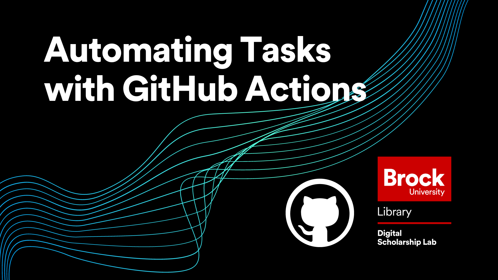

# Automating tasks with GitHub Actions
In this workshop, attendees will learn about the Actions aspect of GitHub which allows you to write workflows that can spin up processing environments, run commands and special functions called “Actions” and then close those environments automatically.  This workshop is the fourth and final workshop in the GitHub Workshop Series offered by the Brock University Digital Scholarship Lab.

An understanding of using GitHub and basic experience with shell commands is recommended to get the most out of this workshop  

*Estimated workshop length: 1.5 hours*

----
## Setup
In preparation for this workshop, you will need the following: 

 - A GitHub account which you can get by clicking the "Sign Up" button at the top right of [https://github.com/](https://github.com/).
 - GitHub Desktop which can be acquired at [https://desktop.github.com/](https://desktop.github.com/).  Keep in mind that if you are not using a personal computer for this workshop, you may need to contact your IT department for permission to install new software.  
  
----
## Helpful Materials

[GitHub Actions Homepage](https://github.com/features/actions): GitHubs official page discussing what is possible with GitHub Actions.  
[GitHub Actions Official Documentation](https://docs.github.com/en/actions): The official GitHub Actions documentation covering every aspect of what can be done along with descriptions of all of the terminology.  

----
## Workshop Tasks

1. In your repository, open the “Actions” tab and if you aren’t already on the new workflow page, click the “New workflow” button
2. Browse the pre-built workflows to see what is available and then click “Configure” on the workflow called “Simple workflow”
3. Explore the workflow editor, making sure to take a quick look at the “Documentation” tab
4. Change the name of the workflow
5. Change the name of the job from “build” to something different, keeping in mind that the only special characters you can use are dashes and underscores (no spaces!)
6. Change one of the steps in the job.  This can be as simple as altering the words printed by the “echo” command or as complex as you like!
7. Click the “Start commit” button, fill out the commit message, and commit your workflow
8. Go to the “Actions” tab and see your workflow in action!  Depending on how quick you are it may already be done running, but you can still look at the processes it took
9. Once you have done all that, type “WORKFLOW ACTIVATED!!!” in the chat to let me know you are ready to move on

## Next Steps

After completing this workshop, the recommended next steps are:

 - Try out different workflows to see how they work.  The more you use them the easier it will be to implement more complex tasks when you need to!
 - Check out the other workshops in our introduction to GitHub Series
   - [Introduction to GitHub Repositories and GitHub Desktop](https://brockdsl.github.io/Introduction-to-GitHub-Repositories-and-GitHub-Desktop/)
   - [Collaborating with Version Control on GitHub](https://brockdsl.github.io/Collaborating-with-Version-Control-on-GitHub/)
   - [Making a Free Webpage with GitHub Pages](https://brockdsl.github.io/Making-a-Free-Webpage-with-GitHub-Pages/)
  
 
 ----

  
**This workshop is brought to you by the Brock University Digital Scholarship Lab.  For a listing of our upcoming workshops go to [Experience BU](https://experiencebu.brocku.ca/organization/dsl) if you are a Brock affiliate or [Eventbrite page](https://www.eventbrite.ca/o/brock-university-digital-scholarship-lab-21661627350) for external attendees.**

